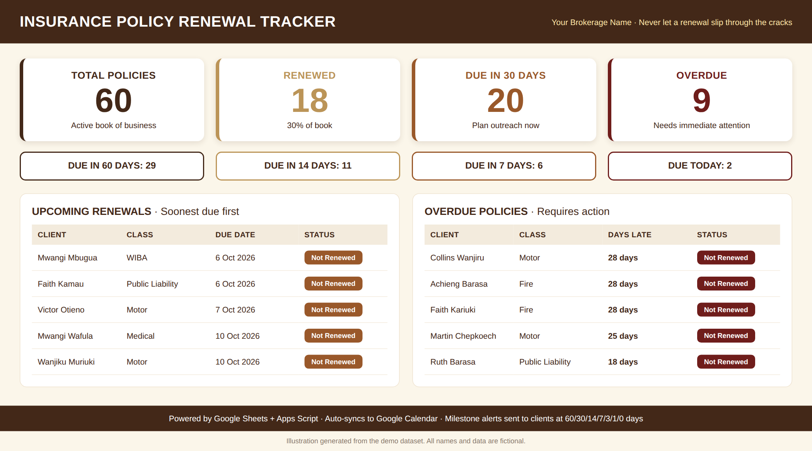
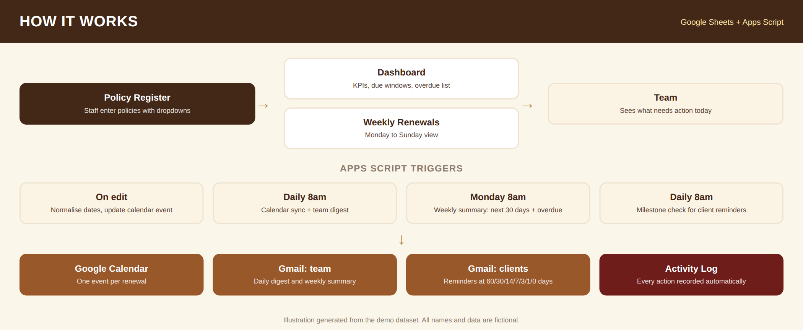
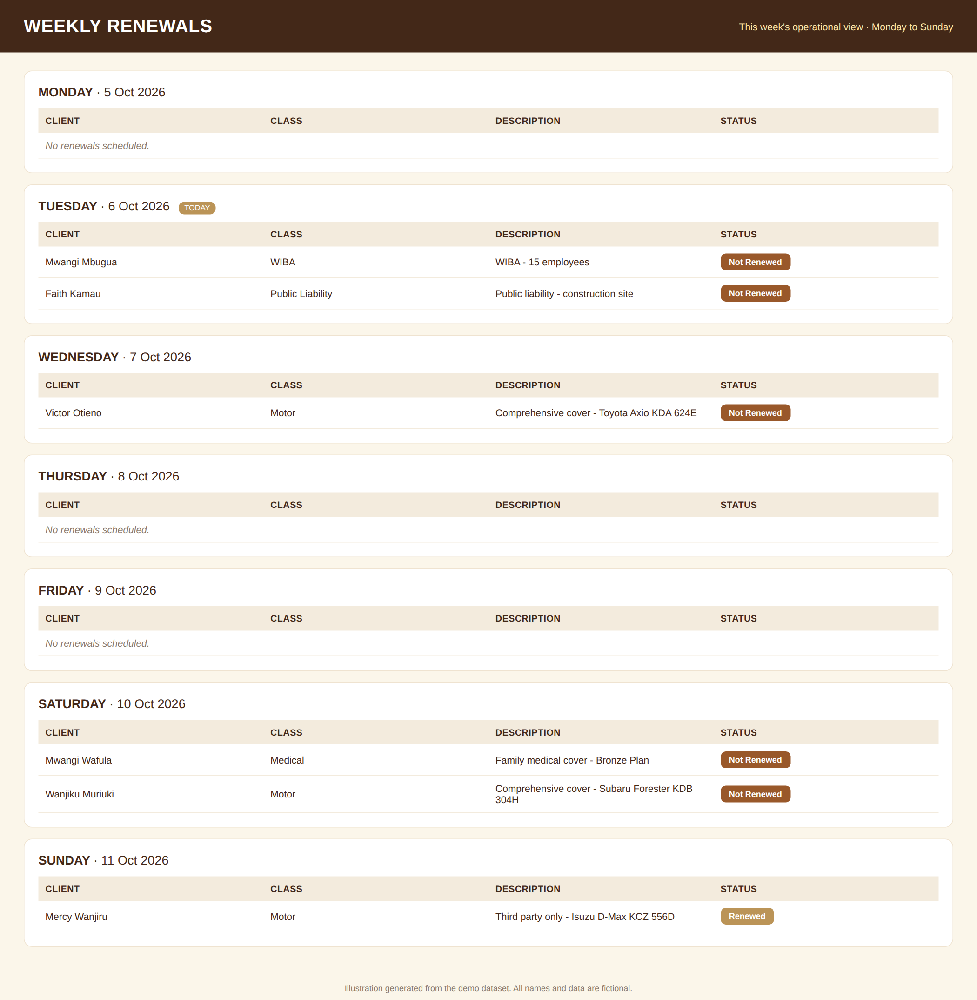
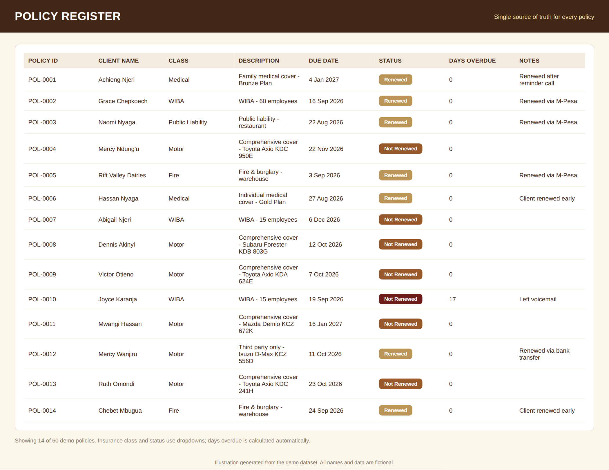
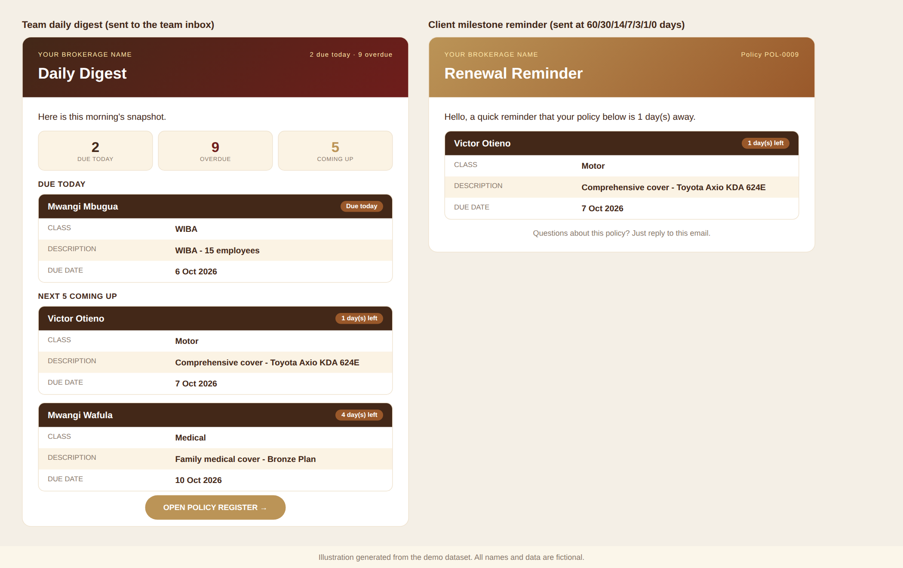

# Insurance Policy Renewal Tracker

A Google Sheets and Apps Script system that helps insurance brokers stop losing renewals. It turns a simple policy register into a live dashboard, sends tiered email reminders, and syncs every due date to Google Calendar.

*Dashboard with the 60-policy demo dataset. All data is fictional.*

## The problem

Brokers often track renewals by hand across spreadsheets, calendars and memory. A missed renewal means a lapsed client, lost commission and an avoidable uncomfortable phone call. The brokerage needs one place that shows what is due, what is late and who has already been chased.

## What it does

| Feature | What it gives the team |
|---|---|
| Policy Register | One source of truth for every policy, with dropdowns for class and status so the data stays clean |
| Dashboard | Live KPIs: total policies, renewed, due in 7, 14, 30 and 60 days, due today, overdue |
| Weekly Renewals view | Monday to Sunday operational view, grouped by due date |
| Daily digest and weekly summary | Branded HTML emails to a team inbox: due today, overdue count, next 30 days |
| Milestone alerts | Client-facing reminders that fire once per policy at 60, 30, 14, 7, 3, 1 and 0 days before expiry |
| Calendar sync | Every renewal appears on a dedicated Google Calendar and updates when the sheet is edited |
| Activity Log | Automatic record of every reminder and action, for accountability |

## Key metrics

| Metric | How it is calculated |
|---|---|
| Renewal rate | Renewed policies divided by total policies |
| Due windows | Open policies with a due date in the next 7, 14, 30 and 60 days |
| Overdue count and days late | Open policies past their due date, ranked by days overdue |
| Workload by day | Policies grouped by due date for the current week |

## How it works

| Layer | Tools |
|---|---|
| Data entry and storage | Google Sheets, data validation dropdowns |
| Analytics | COUNTIFS, SUMPRODUCT, INDEX/MATCH ranking formulas, conditional formatting |
| Automation | Google Apps Script with time-driven and on-edit triggers |
| Integrations | Gmail (HTML email), Google Calendar |

Some design decisions worth knowing:

| Decision | Reason |
|---|---|
| Ranking helper columns instead of a pivot or query | Keeps the dashboard working in a plain copy of the sheet with no add-ons |
| Dates normalised against the sheet's own timezone | Early versions showed dates a day off when the script and sheet timezones differed |
| Milestone tracking stored in a hidden column | Guarantees each client nudge fires once, even if the trigger runs again |
| Trigger times held in one constant | Makes testing possible without waiting until 8am |

## Screenshots

| View | Preview |
|---|---|
| Weekly Renewals |  |
| Policy Register |  |
| Email notifications |  |

## Quick start

1. Open `Insurance_Policy_Renewal_Tracker_DEMO.xlsx` in Google Sheets (File, Import, then open as a Google Sheet).
2. Go to Extensions, then Apps Script, and paste in the contents of `src/Code.gs`.
3. Set `TEAM_INBOX` near the top of the script to your shared inbox.
4. Run `setupDailyTrigger()` once and accept the Calendar and Gmail permissions.
5. Add policies in the Policy Register from row 5 down.

The demo file contains 60 fictional policies so you can see every view working. All names and emails are made up.

## Lessons learned

| Challenge | What I did |
|---|---|
| Dates drifting by a day | Rebuilt date handling to parse against the spreadsheet timezone explicitly |
| Duplicate calendars on repeat setup | Made the setup function always resolve the same calendar before creating one |
| Overdue policies showing in the "upcoming" list | Added a due date check to the ranking formula so only future renewals are ranked |

## Roadmap

| Idea | Value |
|---|---|
| Premium amount column and "premium at risk" KPI | Puts a money figure on what is overdue |
| Renewal rate by insurance class and by month | Shows where the book leaks |
| Power BI version connected to the register | Richer analysis for larger brokerages |

## About

Built by Catherine, Business Analyst at Vision One Group, Nairobi. Connect with me on LinkedIn: [add link].

All data in this repository is fictional.
